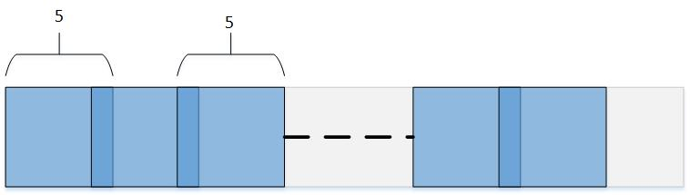

Introduction to the Tensor & Tiling Library (TTL)
=================================================

CONTENTS:
---------

- [Introduction to the Tensor \& Tiling Library (TTL)](#introduction-to-the-tensor--tiling-library-ttl)
  - [CONTENTS:](#contents)
  - [Introduction](#introduction)
    - [Example](#example)
  - [Background](#background)
    - [Tiling](#tiling)
    - [Design Principles](#design-principles)
  - [TTL Logical Tiling](#ttl-logical-tiling)
    - [TTL\_create\_shape](#ttl_create_shape)
    - [TTL\_create\_overlap](#ttl_create_overlap)
    - [TTL\_tile\_t](#ttl_tile_t)
    - [TTL\_tiler\_t](#ttl_tiler_t)
  - [TTL Physical Tensors](#ttl-physical-tensors)
    - [TTL\_create\_layout](#ttl_create_layout)
    - [TTL\_\[const\]\_\[int,ext\]\_\[sub\]\_tensor\_t](#ttl_const_intext_sub_tensor_t)
    - [TTL\_io\_tensors](#ttl_io_tensors)
  - [TTL Import and Export Transactions](#ttl-import-and-export-transactions)
  - [TTL Pipelining Schemes](#ttl-pipelining-schemes)
    - [Pipelining Iterations](#pipelining-iterations)
    - [Duplex Buffering](#duplex-buffering)
    - [Double Buffering](#double-buffering)
    - [Simplex Buffering](#simplex-buffering)
  - [TTL Tiling Loop Parallelization](#ttl-tiling-loop-parallelization)
  - [Debugging](#debugging)
  - [Tiling Code Examples](#tiling-code-examples)
    - [Duplex Buffering Scheme](#duplex-buffering-scheme)
    - [Double Buffering Scheme](#double-buffering-scheme)
    - [Simplex Buffering Scheme](#simplex-buffering-scheme)
    - [Overlapped Tiler](#overlapped-tiler)
    - [Parallelizing Tiling Loop](#parallelizing-tiling-loop)
    - [Manual Double Buffering: dxDMA](#manual-double-buffering-dxdma)

Introduction
------------

Code developed for devices that process data exceeding the capacity of
their local memory must be partitioned into a series of stages, each of which
processes data that fits in the available local memory. Even if local memory is large
enough to accommodate all data in one single stage, it may be beneficial to
partition code into multiple stages to better cope with the latency of copying
data into and out of local memory. Such copying can be done asynchronously in OpenCL
via `async_copy()` builtin functions, which we refer to as `import` and `export`.

Code for accelerators is often partitioned manually, resulting in code that is
in general difficult and cumbersome to write, hard to read, share, optimize, and
maintain.

The Tensor & Tiling Library is designed to
provide **transparent,** **modular**, and **extensible** **building-blocks** in **C**,
to support developing code for local memory based accelerators, and in general
where multi-dimensional tensors appear and are potentially tiled and pipelined.

### Example

As a preliminary example, Tensor Tiling Library can be used as follows to tile a
trivial a[i][j]=b[i][j]+1 kernel:

~~~~~~~~~~~~~~~~~~~~~~~~~~~~~~~~~~~~~~~~~~~~~~~~~~~~~~~~~~~~~~~~~~~~~~~~~~~~~~~~
#define __TTL_VERSION__ 03 // Specify latest TTL version
#include "TTL.h"

#define TILE_WIDTH 100
#define TILE_HEIGHT 100
#define TILE_SIZE (TILE_WIDTH * TILE_HEIGHT)

void compute(TTL_int_tensor_t t_in, TTL_int_tensor_t t_out) {
   __local uchar *l_in = t_in.base;
   __local uchar *l_out = t_out.base;

   for (unsigned int y = 0; y < t_in.shape.height; y++) {
     for (unsigned int x = 0; x < t_in.shape.width; x++) {
       int idx_out = y * t_out.layout.total_row_length + x;
       int idx_in = y * t_in.layout.total_row_length + x;
       l_out[idx_out] = l_in[idx_in] + 1;
     }
   }
}

__kernel void add_one(__global char *restrict input_image, __global char *restrict output_image,
                      int image_width, int image_height, int image_stride)
{
 __local uchar l_in[TILE_SIZE];
 __local uchar l_out[TILE_SIZE];
 
 // Regular tiling depends only on geometry aka logical tensors:
 TTL_shape_t image_shape = TTL_create_shape(image_width, image_height);
 TTL_shape_t tile_shape = TTL_create_shape(TILE_WIDTH, TILE_HEIGHT);
 TTL_tiler_t tiler = TTL_create_tiler(image_shape, tile_shape);
 
 // Accessing memory depends on layout aka physical tensors, where strides are absolute:
 TTL_layout_t external_layout = TTL_create_layout(image_stride);
 
 for (int tile_id = 0; tile_id < TTL_number_of_tiles(tiler); ++tile_id) {
   TTL_tile_t tile = TTL_get_tile(tile_id, tiler);
   TTL_int_tensor_t import_to = TTL_create_int_tensor(l_in, tile);
   TTL_int_tensor_t export_from = TTL_create_int_tensor(l_out, tile);
   TTL_ext_tensor_t import_from = TTL_create_ext_tensor(input_image, tile, external_layout);
   TTL_ext_tensor_t export_to = TTL_create_ext_tensor(output_image, tile, external_layout);

   TTL_blocking_import(import_to, import_from);
   compute(import_to, export_from);
   TTL_blocking_export(export_from, export_to);
 }
}
~~~~~~~~~~~~~~~~~~~~~~~~~~~~~~~~~~~~~~~~~~~~~~~~~~~~~~~~~~~~~~~~~~~~~~~~~~~~~~~~

Background
----------

### Tiling

The **data** accessed by a function can be made to fit in local memory
by **partitioning its control-flow** into stages, such that the data accessed by
each stage fits in local memory. In all cases considered, this partitioning takes
the form *Loop Tiling*, where an initial unfitting loop nest such as:

~~~~~~~~~~~~~~~~~~~~~~~~~~~~~~~~~~~~~~~~~~~~~~~~~~~~~~~~~~~~~~~~~~~~~~~~~~~~~~~~
 for (int y = 0; y < TooManyRows; ++y)
   for (int x = 0; x < TooManyColumns; ++x)
     A[y * StrideA + x] = B[y * StrideB + x] + 1;
~~~~~~~~~~~~~~~~~~~~~~~~~~~~~~~~~~~~~~~~~~~~~~~~~~~~~~~~~~~~~~~~~~~~~~~~~~~~~~~~

is strip-mined/blocked/tiled in (either or) both loops to produce:

~~~~~~~~~~~~~~~~~~~~~~~~~~~~~~~~~~~~~~~~~~~~~~~~~~~~~~~~~~~~~~~~~~~~~~~~~~~~~~~~
 for (int y = 0; y < TooManyRows; y += TileY)
   for (int x = 0; x < TooManyColumns; x += TileX) {
     // Start of stage.
     for (int yy = y; yy < min(y + TileY , TooManyRows); ++yy)
       for (int xx = x; xx < min(x + TileX, TooManyColumns); ++xx)
         A[yy * StrideA + xx] = B[yy * StrideB + xx] + 1;
     // End of stage.
   }
~~~~~~~~~~~~~~~~~~~~~~~~~~~~~~~~~~~~~~~~~~~~~~~~~~~~~~~~~~~~~~~~~~~~~~~~~~~~~~~~

Loop tiling produces an outer-loop, in the above case a doubly-nested
outer-loop, that iterates over stages or tiles. These outer loops could be
represented as:

~~~~~~~~~~~~~~~~~~~~~~~~~~~~~~~~~~~~~~~~~~~~~~~~~~~~~~~~~~~~~~~~~~~~~~~~~~~~~~~~
 for (int tile_id = 0; tile_id < number_of_tiles; ++tile_id) {
   // Derive y, x, and tile parameters from tile_id.
 }
~~~~~~~~~~~~~~~~~~~~~~~~~~~~~~~~~~~~~~~~~~~~~~~~~~~~~~~~~~~~~~~~~~~~~~~~~~~~~~~~

Notice that both arrays A and B in the above example are tiled together. Arrays
with multiple accesses of distinct offsets, such as in stencil access patterns,
result in tiles that overlap. Arrays that are accessed with non-unit strides
should be allocated increased memory accordingly along the x dimension - as if
their element size has increased.

This transformation partitions or tiles the *Iteration Space* of a nested loop,
thereby also partitioning or tiling the *Memory Space* of each array accessed in
the loop. Tiling traditionally involves a single (usually 2D) tile size which
applies to the outer-loop of a loop-nest in terms of iterations, and thereby to
all tiled arrays of the loop in terms of elements. It can be extended to
multiple loops by conceptually fusing them together. Each array however may
require a distinct tile size due to its unique access pattern, and to be bumped
by a unique stride along a distinct loop dimension.

Once a loop and the arrays it accesses have been tiled, the operations involved
with copying the data of each tile can be double buffered and pipelined
across loop iterations, thereby overlapping data communication with computation,
and overlapping asynchronous imports and exports.

### Design Principles

The Tensor Tiling Library is designed to be

-   **Transparent**: the types and functions of the library are all exposed and
    visible to the user; there are no hidden components. This helps clarify
    exactly what the library supports, and how.

-   **Modular**: the library provides several constructs that can be used
    separately or in combination. This includes a construct for tensors, for
    regular tiling, a construct for importing and exporting single tiles, and a
    construct for pipelining a single or pairs of import/export transactions.

-   **Extensible**: any part of the library can be copied and modified locally;
    new parts can be added locally to the library. Modification and additions
    regarded as generally useful should be considered for inclusion in the
    library.

-   **Easy to use**: provides simple and easy to use patterns, all included in
    header-files only.

A *tile* is considered to be a memory region that can be copied asynchronously.
Therefore, a tile is in general a 3-dimensional *tensor* of elements, embedded
within an enclosing memory layout.

In TTL tiles are defined with optional overlap in every dimension (see next
section). For example, the following figure shows the tiling along x-dimension
produced by a tiler with 2D space shape of (5, 250), 2D tile shape of (5, 5),
and **overlap.width**=1, so that every pair of horizontally-adjacent tiles has
one column of elements in common:

The following figure shows all 15 tiles produced by a non-overlapping tiler with
2D space shape of {900, 800} and 2D tile shape of {200, 300}.

Note that tiles appearing last in each dimension are of smaller size - the
remainder of dividing 900 by 200 and 800 by 300. Each tile has a unique ID from
zero to **number_of_tiles**-1, following row-major or column-major order:

The following sections describe the layers of API provided by TTL.

TTL Logical Tiling
------------------

The first layer of TTL deals with logical tiling of 3D shapes. The basic unit of
these shapes - an "element" - is independent of its actual size or location in
memory, hence the term "logical". The associated "physical" aspects of size and
location in memory are dealt with separately.

### TTL_create_shape

TTL_shape_t defines the number of elements along each dimension in a 3D box:

~~~~~~~~~~~~~~~~~~~~~~~~~~~~~~~~~~~~~~~~~~~~~~~~~~~~~~~~~~~~~~~~~~~~~~~~~~~~~~~~
typedef struct {
  TTL_dim_t width;  // Number of elements along dimension x.
  TTL_dim_t height; // Number of rows along dimension y
  TTL_dim_t depth;  // Number of planes along dimension z
} TTL_shape_t;
~~~~~~~~~~~~~~~~~~~~~~~~~~~~~~~~~~~~~~~~~~~~~~~~~~~~~~~~~~~~~~~~~~~~~~~~~~~~~~~~

TTL_create_shape() APIs define shapes of desired dimensions, complementing
remaining dimensions with '1's:

~~~~~~~~~~~~~~~~~~~~~~~~~~~~~~~~~~~~~~~~~~~~~~~~~~~~~~~~~~~~~~~~~~~~~~~~~~~~~~~~
TTL_shape_t TTL_create_shape(TTL_dim_t width);
TTL_shape_t TTL_create_shape(TTL_dim_t width, TTL_dim_t height);
TTL_shape_t TTL_create_shape(TTL_dim_t width, TTL_dim_t height, TTL_dim_t depth);
~~~~~~~~~~~~~~~~~~~~~~~~~~~~~~~~~~~~~~~~~~~~~~~~~~~~~~~~~~~~~~~~~~~~~~~~~~~~~~~~

A "Big" 3D box can be partitioned into pairwise disjointed "Small" 3D boxes,
simply by defining the two boxes as TTL_shape_t's and using them to construct a
TTL_tiler_t:

~~~~~~~~~~~~~~~~~~~~~~~~~~~~~~~~~~~~~~~~~~~~~~~~~~~~~~~~~~~~~~~~~~~~~~~~~~~~~~~~
TTL_tiler_t TTL_create_tiler(TTL_shape_t Big, TTL_shape_t Small);
~~~~~~~~~~~~~~~~~~~~~~~~~~~~~~~~~~~~~~~~~~~~~~~~~~~~~~~~~~~~~~~~~~~~~~~~~~~~~~~~

This TTL_tiler_t can then be used to traverse all the parts of Big's partition
(referred to as "tiles") each of size Small (or smaller), as explained below.

A Big 3D box can be partitioned into overlapping Small 3D boxes - where every
pair of adjacent parts share a fixed number of elements along each dimension,
using the following constructs:

### TTL_create_overlap

TTL_overlap_t defines the number of elements shared between two adjacent tiles
along each dimension of a 3D box:

~~~~~~~~~~~~~~~~~~~~~~~~~~~~~~~~~~~~~~~~~~~~~~~~~~~~~~~~~~~~~~~~~~~~~~~~~~~~~~~~
typedef struct {
  TTL_overlap_dim_t width;
  TTL_overlap_dim_t height;
  TTL_overlap_dim_t depth;
} TTL_overlap_t;
~~~~~~~~~~~~~~~~~~~~~~~~~~~~~~~~~~~~~~~~~~~~~~~~~~~~~~~~~~~~~~~~~~~~~~~~~~~~~~~~

TTL_create_overlap() APIs define the overlaps along the desired dimensions,
complementing remaining dimensions with '0's:

~~~~~~~~~~~~~~~~~~~~~~~~~~~~~~~~~~~~~~~~~~~~~~~~~~~~~~~~~~~~~~~~~~~~~~~~~~~~~~~~
TTL_overlap_t TTL_create_overlap(TTL_overlap_dim_t width);
TTL_overlap_t TTL_create_overlap(TTL_overlap_dim_t width, TTL_overlap_dim_t height);
TTL_overlap_t TTL_create_overlap(TTL_overlap_dim_t width, TTL_overlap_dim_t height, TTL_overlap_dim_t depth);
~~~~~~~~~~~~~~~~~~~~~~~~~~~~~~~~~~~~~~~~~~~~~~~~~~~~~~~~~~~~~~~~~~~~~~~~~~~~~~~~

An overlap can then be used together with Big and Small to create the desired
overlapping tiler:

~~~~~~~~~~~~~~~~~~~~~~~~~~~~~~~~~~~~~~~~~~~~~~~~~~~~~~~~~~~~~~~~~~~~~~~~~~~~~~~~
TTL_tiler_t TTL_create_overlap_tiler(TTL_shape_t Big, TTL_shape_t Small, TTL_overlap_t Overlap);
~~~~~~~~~~~~~~~~~~~~~~~~~~~~~~~~~~~~~~~~~~~~~~~~~~~~~~~~~~~~~~~~~~~~~~~~~~~~~~~~

### TTL_tile_t

TTL_tile_t defines the shape and position of each part in a partitioning
produced by TTL_tiler_t:

~~~~~~~~~~~~~~~~~~~~~~~~~~~~~~~~~~~~~~~~~~~~~~~~~~~~~~~~~~~~~~~~~~~~~~~~~~~~~~~~
typedef struct {
  TTL_shape_t shape;
  TTL_shape_t offset; // In terms of number of elements
} TTL_tile_t;
~~~~~~~~~~~~~~~~~~~~~~~~~~~~~~~~~~~~~~~~~~~~~~~~~~~~~~~~~~~~~~~~~~~~~~~~~~~~~~~~

The offset defines where each tile "starts" and is therefore distinct across the
tiles of a tiler, with a first tile typically starting at offset zero. The
shapes are typically equal to the Small shape provided to the tiler, except for
last tiles along each dimension which may be smaller. A tile having zero shape
represents an empty or out-of-range tile.

### TTL_tiler_t

TTL_tiler_t provides the following APIs:

~~~~~~~~~~~~~~~~~~~~~~~~~~~~~~~~~~~~~~~~~~~~~~~~~~~~~~~~~~~~~~~~~~~~~~~~~~~~~~~~
int TTL_number_of_tiles(TTL_tiler_t t);       // Total number of tiles
TTL_dim_t TTL_tiles_in_width(TTL_tiler_t t);  // Number of tiles in width
TTL_dim_t TTL_tiles_in_height(TTL_tiler_t t); // Number of tiles in height
TTL_dim_t TTL_tiles_in_depth(TTL_tiler_t t);  // Number of tiles in depth
TTL_tile_t TTL_get_tile(int tile_id, TTL_tiler_t *t); // Return tile number tile_id, empty if tile_id is out of range
int TTL_valid_tile_id(int tile_id, TTL_tiler_t t);    // Check if tile_id is in range
~~~~~~~~~~~~~~~~~~~~~~~~~~~~~~~~~~~~~~~~~~~~~~~~~~~~~~~~~~~~~~~~~~~~~~~~~~~~~~~~

TTL Physical Tensors
--------------------

The second layer of TTL deals with projecting or laying out logical tiles onto
physical memory spaces.

Note that separating logical tiling from memory considerations facilitates
reusing the same TTL_tiler_t to tile distinct images (located in different
memory addresses) with potentially distinct element sizes and memory alignments,
provided they contain the same number and shape of elements to be tiled the same
way.

### TTL_create_layout

Each tile is embedded in global and local memories within some enclosing shape,
e.g., to account for possible alignment padding. This embedding is referred to
as *layout*, which specifies the spacing between the start of consecutive rows in
units of elements, and spacing of the between start of consecutive planes in units
of elements.

~~~~~~~~~~~~~~~~~~~~~~~~~~~~~~~~~~~~~~~~~~~~~~~~~~~~~~~~~~~~~~~~~~~~~~~~~~~~~~~~
typedef struct {
    TTL_dim_t row_spacing;    ///< The distance between the start of consequtive rows in units of elements.
    TTL_dim_t plane_spacing;  ///< The distance between the start of consequtive planes in units of elements.
} TTL_layout_t;
~~~~~~~~~~~~~~~~~~~~~~~~~~~~~~~~~~~~~~~~~~~~~~~~~~~~~~~~~~~~~~~~~~~~~~~~~~~~~~~~

TTL_create_layout() APIs define the layouts along the desired dimensions:

~~~~~~~~~~~~~~~~~~~~~~~~~~~~~~~~~~~~~~~~~~~~~~~~~~~~~~~~~~~~~~~~~~~~~~~~~~~~~~~~
TTL_layout_t TTL_create_layout();
TTL_layout_t TTL_create_layout(TTL_dim_t total_row_length);
TTL_layout_t TTL_create_layout(TTL_dim_t total_row_length, TTL_dim_t total_number_of_rows);

~~~~~~~~~~~~~~~~~~~~~~~~~~~~~~~~~~~~~~~~~~~~~~~~~~~~~~~~~~~~~~~~~~~~~~~~~~~~~~~~

### TTL_ type family tensor_t

TTL_[const]\_[int/ext]\_[sub]_tensor_t combine the logical dimensions of a tile
along with its physical mapping to memory. The two constructs allow the creation
of local [int] and global [ext] versions with a const attribute. The
TTL_tensor_t structs contain all the information needed for issuing an import or
export transaction, and for reading and writing to the tensor.

As well as usage for tiling the tensors should also be passed to compute
functions. The type contains all the data needed to read from a tile that was
imported and write to a tile before it is exported, except for the element type.
An external tensor can also be passed to the kernel as it contains all data
needed for tiling, importing and exporting.

~~~~~~~~~~~~~~~~~~~~~~~~~~~~~~~~~~~~~~~~~~~~~~~~~~~~~~~~~~~~~~~~~~~~~~~~~~~~~~~~
typedef struct {
  [const] __[local/global] void *base;
  TTL_dim_t elem_size;
  TTL_layout_t layout;
  TTL_shape_t shape;
#if sub
  struct {
    TTL_shape_t shape;
    TTL_offset_t sub_offset;
    } origin;
#endif
} TTL_[const]_[ext/int]_[sub]_tensor_t ;
~~~~~~~~~~~~~~~~~~~~~~~~~~~~~~~~~~~~~~~~~~~~~~~~~~~~~~~~~~~~~~~~~~~~~~~~~~~~~~~~

Tensors of the following types exit.

TTL_int_tensor_t;  
TTL_const_int_tensor_t;  
TTL_int_sub_tensor_t;  
TTL_const_int_sub_tensor_t;  
TTL_ext_tensor_t;  
TTL_const_ext_tensor_t;  
TTL_ext_sub_tensor_t;  
TTL_const_ext_sub_tensor_t;

~~~~~~~~~~~~~~~~~~~~~~~~~~~~~~~~~~~~~~~~~~~~~~~~~~~~~~~~~~~~~~~~~~~~~~~~~~~~~~~~
// Construct a buffer with default, packed layout, whose strides match the provided shape and element size w/o padding.
// Element size is implicitly set to gentype size, where gentype represents any type amenable to sizeof, including but not restricted to OpenCL vector types, structs, but excluding void.
TTL_int_tensor_t TTL_create_int_tensor(__local gentype *base, TTL_tile_t tile);

// Element size is implicitly set to gentype size, where gentype represents any type amenable to sizeof, including but not restricted to OpenCL vector types, structs, but excluding void.
TTL_int_tensor_t TTL_create_int_tensor(__local gentype *base, TTL_tile_t tile, TTL_layout_t int_layout);

// Explicit layout and element size
TTL_int_tensor_t TTL_create_int_tensor(__local gentype *base, TTL_tile_t tile, TTL_layout_t int_layout, int elem_size);

// Element size is implicitly set to gentype size, where gentype represents any type amenable to sizeof, including but not restricted to OpenCL vector types, structs, but excluding void.
TTL_ext_tensor_t TTL_create_ext_tensor(__global gentype *base, TTL_tile_t tile, TTL_layout_t ext_layout);

// Explicit layout and element size
TTL_ext_tensor_t TTL_create_ext_tensor(__global gentype *base, TTL_tile_t tile, TTL_layout_t ext_layout, int elem_size);

// Returns 1 if an internal tensor 'tensor' is valid, i.e. has a non-empty shape. Otherwise, returns 0.
// Useful when prolog/epilogs creates non-valid tensors.
int TTL_valid_int_tensor(TTL_int_tensor_t tensor);
~~~~~~~~~~~~~~~~~~~~~~~~~~~~~~~~~~~~~~~~~~~~~~~~~~~~~~~~~~~~~~~~~~~~~~~~~~~~~~~~

Explicit layouts and/or element size can be provided by overriding the default
values. The API can also be extended with constructors for explicit sizes, if
needed.

### TTL_io_tensors

TTL_io_tensors_t holds two internal tensors ready for processing: imported_to as
input tensor and to_export_from as output tensor:

~~~~~~~~~~~~~~~~~~~~~~~~~~~~~~~~~~~~~~~~~~~~~~~~~~~~~~~~~~~~~~~~~~~~~~~~~~~~~~~~
typedef struct {
  TTL_int_tensor_t imported_to;
  TTL_int_tensor_t to_export_from;
} TTL_io_tensors_t;

// Returns true if tensors are valid.
// Useful when prolog/epilogs creates non-valid tensors.
int TTL_valid_tensors(TTL_io_tensors_t tensors);
~~~~~~~~~~~~~~~~~~~~~~~~~~~~~~~~~~~~~~~~~~~~~~~~~~~~~~~~~~~~~~~~~~~~~~~~~~~~~~~~

TTL Import and Export Transactions
----------------------------------

The third layer of TTL deals with transactions that copy tensors from global to
local memory and back, referred to as import and export, respectively. These
transactions are asynchronous and correspond to async_work_group_copy() builtin
functions of OpenCL and their use of "event_t". Similar to OpenCL, in TTL one
event_t can serve multiple transactions, and it is possible to wait on multiple
events. Unlike OpenCL, every import and export in TTL must be provided a
non-null event_t, which can be produced by TTL_get_event().

~~~~~~~~~~~~~~~~~~~~~~~~~~~~~~~~~~~~~~~~~~~~~~~~~~~~~~~~~~~~~~~~~~~~~~~~~~~~~~~~
TTL_event_t TTL_get_event(); // Initialize an event.

// Import the data in external_tensor to internal_tensor.
// The transaction is added to the event e.
void TTL_import(TTL_int_tensor_t internal_tensor, TTL_ext_tensor_t external_tensor, TTL_event_t *e);

// Export the data in internal_tensor to external_tensor.
// The transaction is added to the event e.
void TTL_export(TTL_int_tensor_t internal_tensor, TTL_ext_tensor_t external_tensor, TTL_event_t *e);

void TTL_wait(int num_events, TTL_event_t *events); // Wait for first num_events in events array
~~~~~~~~~~~~~~~~~~~~~~~~~~~~~~~~~~~~~~~~~~~~~~~~~~~~~~~~~~~~~~~~~~~~~~~~~~~~~~~~

TTL_blocking_import/export can be used to issue a blocking transaction, i.e.,
get an event, issue a transaction and immediately wait for its completion:

~~~~~~~~~~~~~~~~~~~~~~~~~~~~~~~~~~~~~~~~~~~~~~~~~~~~~~~~~~~~~~~~~~~~~~~~~~~~~~~~
void TTL_blocking_import(TTL_int_tensor_t internal_tensor, TTL_ext_tensor_t external_tensor);
void TTL_blocking_export(TTL_int_tensor_t internal_tensor, TTL_ext_tensor_t external_tensor);
~~~~~~~~~~~~~~~~~~~~~~~~~~~~~~~~~~~~~~~~~~~~~~~~~~~~~~~~~~~~~~~~~~~~~~~~~~~~~~~~

TTL Pipelining Schemes
----------------------

The fourth layer of TTL deals with overlapping pairs of asynchronous import and
export transactions and buffering pairs of internal tensors to facilitate
pipelining of imports and exports.

TTL provides several schemes to help pipeline import and/or export transactions
of tiles across a loop-over-tiles to overlap the transactions with computations
and/or with themselves. Each scheme contains a struct, a defining function and a
bumping function. The defining function initializes the struct and is placed
before the loop to store data across loop iterations. The bumping function
initializes and finalizes the transactions, returning TTL_tensor_t(s) to be used
by their associated computation, and is placed inside the loop before the
computations.

A TTL_int_tensor_t returned by a bumping function that is associated with an
import represents a tensor ready to be read-from, while a returned
TTL_int_tensor_t associated with an export is ready to be written-to and
exported in the next invocation of the bumping function. The bumping functions
receive a single tile, which may be the current or next tile, and record past
tiles as needed.

Each scheme indicates how may prolog and/or epilog iterations it requires in
order for its bumping function to be invoked sufficiently many times before
and/or after their computation.

### Pipelining Iterations

A scheme may require additional prolog and/or epilog iterations, which are
represented and manipulated as follows:

~~~~~~~~~~~~~~~~~~~~~~~~~~~~~~~~~~~~~~~~~~~~~~~~~~~~~~~~~~~~~~~~~~~~~~~~~~~~~~~~
typedef struct {
  int prolog; // Represents number of extra iterations which should be
              // subtracted from the start of the loop-over-tiles.
  int epilog; // Represents number of extra iterations which should be added to
              // the end of the loop-over-tiles.
} TTL_pipeline_iterations_t;

// Returns the number of prologs and epilogs required by a pipelining scheme.
TTL_pipeline_iterations_t TTL_create_pipeline_iterations(void *scheme_base);

// Given existing pipeline_iterations struct and a pointer to a scheme, returns the required number of prologs and epilogs (performs maximum operation).
TTL_pipeline_iterations_t TTL_join_pipeline_iterations(void *scheme_base, TTL_pipeline_iterations_t pipeline_iters);
~~~~~~~~~~~~~~~~~~~~~~~~~~~~~~~~~~~~~~~~~~~~~~~~~~~~~~~~~~~~~~~~~~~~~~~~~~~~~~~~

### Duplex Buffering

Given pair of blocking import and export that can execute concurrently,
TTL_duplex_buffering issues them together and then waits on both to complete,
hopefully executing them in parallel to each other. This scheme uses two
internal buffers, one for the import and one for the export. Note that the
export is pipelined to pair the import of the current tile with the export of
previous tile.

The following table draws the pipelined actions performed in duplex buffering.
It specifies which tile is processed in each iteration:

| Action\\Iteration | \#0 | \#1 | \#i (2:NumOfTiles-1) | \#NumOfTiles- |
|-------------------|-----|-----|----------------------|---------------|
| **Import**        | 0   | 1   | i                    |               |
| **Wait Import**   | 0   | 1   | i                    |               |
| **Compute**       | 0   | 1   | i                    |               |
| **Export**        |     | 0   | i-1                  | NumOfTiles-1  |
| **WaitExport**    |     | 0   | i-1                  | NumOfTiles-1  |

Notice the epilog (\#NumOfTiles) which is an extra iteration.

Here are the interfaces to create and use the duplex buffering scheme:

~~~~~~~~~~~~~~~~~~~~~~~~~~~~~~~~~~~~~~~~~~~~~~~~~~~~~~~~~~~~~~~~~~~~~~~~~~~~~~~~
TTL_duplex_buffering_t TTL_create_duplex_buffering(__global void *ext_base_in, TTL_layout_t ext_layout_in, __local void *int_base_in, __global void *ext_base_out, TTL_layout_t ext_layout_out, __local void *int_base_out, TTL_event_t *event_in, TTL_event_t *event_out);

// Import current tile, export previous tile and wait for both transactions
// Using the same tile dimensions for both importing and exporting, can also provide two distinct tiles.
// Returns two internal buffers: one for input and one for output
TTL_io_tensors_t TTL_step_buffering(TTL_duplex_buffering_t *scheme, TTL_tile_t tile);
~~~~~~~~~~~~~~~~~~~~~~~~~~~~~~~~~~~~~~~~~~~~~~~~~~~~~~~~~~~~~~~~~~~~~~~~~~~~~~~~

For more infotmation see duplex buffering example.

### Double Buffering

TTL_double_buffering pipelines a duplex import or export transaction using two
internal buffers.

The following table draws the pipelined actions performed in double buffering.
It specifies which tile is processed in each iteration:

| Action\\Iteration | \#-1 | \#0 | \#1 | \#2 | \#i (2:NumOfTiles-2) | \#NumOfTiles-1 | \#NumOfTiles | \#NumOfTiles+1 |
|-------------------|------|-----|-----|-----|----------------------|----------------|--------------|----------------|
| **Wait Import**   |      | 0   | 1   | 2   | i                    | NumOfTiles-1   |              |                |
| **Import**        | 0    | 1   | 2   | 3   | i+1                  |                |              |                |
| **WaitExport**    |      |     |     | 0   | i-2                  | NumOfTiles-3   | NumOfTiles-2 | NumOfTiles-1   |
| **Export**        |      |     | 0   | 1   | i-1                  | NumOfTiles-2   | NumOfTiles-1 |                |
| **Compute**       |      | 0   | 1   | 2   | i                    | NumOfTiles-1   |              |                |

Notice the prolog (at iteration number -1) and the 2 epilogs (at iterations
number NumOfTiles and NumOfTiles+1) which add in total 3 extra iterations.

Here are the interfaces to create and use the double buffering scheme:

~~~~~~~~~~~~~~~~~~~~~~~~~~~~~~~~~~~~~~~~~~~~~~~~~~~~~~~~~~~~~~~~~~~~~~~~~~~~~~~~
TTL_double_buffering_t TTL_create_import_double_buffering(
          __local void *buff1, __local void *buff2, __global void *ext_base_in, TTL_layout_t ext_layout_in, TTL_event_t *event);

TTL_double_buffering_t TTL_create_export_double_buffering(
          __local void *buff1, __local void *buff2, __global void *ext_base_out, TTL_layout_t ext_layout_out, TTL_event_t *event);

// Wait for last import and issue next import
// Returns the waited tensor.
TTL_int_tensor_t TTL_step_buffering(TTL_double_buffering_t *scheme, TTL_tile_t tile);

// Wait for last export and issue next export
// Returns the waited tensor.
TTL_int_tensor_t TTL_step_buffering(TTL_double_buffering_t *scheme, TTL_tile_t tile);
~~~~~~~~~~~~~~~~~~~~~~~~~~~~~~~~~~~~~~~~~~~~~~~~~~~~~~~~~~~~~~~~~~~~~~~~~~~~~~~~

For more information see double buffering example

### Simplex Buffering

TTL_simplex_buffering pipelines a pair of import and export transactions using
three internal buffers, in rotation: each buffer interchangeably serves as input
buffer and output buffer, such that in each iteration one buffer is used both to
export then import and two buffers are used by compute for reading and writing.

With simplex buffering we're only waiting for previous iterations, so DMA
transactions run mostly in parallel to computation, but serially with each
other. Using the same buffer both for import and export is possible allowing us
to overlap exporting from and importing to the same buffer.

The following table draws the pipelined actions performed in simplex buffering.
It specifies which tile is processed in each iteration:

| Action\\Iteration | \#-1 | \#0 | \#1 | \#2 | \#i (2:NumOfTiles-2) | \#NumOfTiles-1 | \#NumOfTiles | \#NumOfTiles+1 |
|-------------------|------|-----|-----|-----|----------------------|----------------|--------------|----------------|
| **WaitExport**    |      |     |     | 0   | i-2                  | NumOfTiles-3   | NumOfTiles-2 | NumOfTiles-1   |
| **Export**        |      |     | 0   | 1   | i-1                  | NumOfTiles-2   | NumOfTiles-1 |                |
| **Wait Import**   |      | 0   | 1   | 2   | i                    | NumOfTiles-1   |              |                |
| **Import**        | 0    | 1   | 2   | 3   | i+1                  |                |              |                |
| **Compute**       |      | 0   | 1   | 2   | i                    | NumOfTiles-1   |              |                |

Notice the prolog (at iteration number -1) and the 2 epilogs (at iterations
number NumOfTiles and NumOfTiles+1) which add in total 3 extra iterations.

Here are the interfaces to create and use the simplex buffering scheme:

~~~~~~~~~~~~~~~~~~~~~~~~~~~~~~~~~~~~~~~~~~~~~~~~~~~~~~~~~~~~~~~~~~~~~~~~~~~~~~~~
TTL_simplex_buffering_t TTL_create_simplex_buffering(__global void *ext_base_in, __global void *ext_base_out, __local void *buff1, __local void *buff2, __local void *buff3, TTL_layout_t ext_layout_in, TTL_layout_t ext_layout_out, TTL_event_t *event_in, TTL_event_t *event_out);

/*
1. Wait for previous import #i and export #i-2
2. Trigger export #i-1, a local async fence or iab, and import #i+1
* Both export #i-2 and import #i happen asynchronously back-to-back, effectively waiting for the latter import only.
*/
TTL_io_tensors_t TTL_step_buffering(TTL_simplex_buffering_t *scheme, TTL_tile_t tile);
~~~~~~~~~~~~~~~~~~~~~~~~~~~~~~~~~~~~~~~~~~~~~~~~~~~~~~~~~~~~~~~~~~~~~~~~~~~~~~~~

For more information see simplex buffering example

See the Group Loop Bounds example for more information.

Debugging
---------

TTL provides debugging information associated with tiling. Define TTL_DEBUG to
turn on debugging:

~~~~~~~~~~~~~~~~~~~~~~~~~~~~~~~~~~~~~~~~~~~~~~~~~~~~~~~~~~~~~~~~~~~~~~~~~~~~~~~~
#define TTL_DEBUG
#define __TTL_VERSION__ 03
#include "TTL.h"
~~~~~~~~~~~~~~~~~~~~~~~~~~~~~~~~~~~~~~~~~~~~~~~~~~~~~~~~~~~~~~~~~~~~~~~~~~~~~~~~

Following is an example of what may be printed by TTL's debug mode:

~~~~~~~~~~~~~~~~~~~~~~~~~~~~~~~~~~~~~~~~~~~~~~~~~~~~~~~~~~~~~~~~~~~~~~~~~~~~~~~~
TTL_IMPORT: event=0x4088(channels mask=0x1) int_addr=0x108000 ext_base=0x4002f6580 ext_offset=(6144, 0, 0) shape=(512, 1, 1) ext_stride=(0, 0) int_stride=(0, 0) // line:62
TTL_EXPORT: event=0x4089(channels mask=0x2) int_addr=0x118000 ext_base=0x400300b80 ext_offset=(5120, 0, 0) shape=(512, 1, 1) ext_stride=(0, 0) int_stride=(0, 0) // line:67
TTL_WAIT: event=0x408a(channels mask=0x4) event=0x408b(channels mask=0x8) // line:69
~~~~~~~~~~~~~~~~~~~~~~~~~~~~~~~~~~~~~~~~~~~~~~~~~~~~~~~~~~~~~~~~~~~~~~~~~~~~~~~~

Tiling Code Examples
--------------------

This section provide code examples of kernels and tests that demonstrate the use
of various TTL features.

### Duplex Buffering Scheme

This example demonstrates how to use duplex buffering pipelining scheme.

~~~~~~~~~~~~~~~~~~~~~~~~~~~~~~~~~~~~~~~~~~~~~~~~~~~~~~~~~~~~~~~~~~~~~~~~~~~~~~~~
#define __TTL_VERSION__ 03
#include "TTL.h"

#define MEM0
#define MEM1
#define MEMORY_SIZE (1 << 14)

void compute(TTL_int_tensor_t tensor_in, TTL_int_tensor_t tensor_out) {
  __local const uchar *restrict MEM0 l_in = tensor_in.base;
  __local uchar *restrict MEM1 l_out = tensor_out.base;
  int width = tensor_in.shape.width;
  int height = tensor_in.shape.height;
  int stride_in = tensor_in.layout.total_row_length;
  int stride_out = tensor_out.layout.total_row_length;

  parrallel_for (y, height) {
    parrallel_for (x, width) {
      l_out[y * stride_out + x] =
          l_in[y * stride_in + x] + 1;
    }
  }
}

static inline void tile2tile_ref(__global uchar *restrict ext_base_in,
                                 int external_stride_in,
                                 __global uchar *restrict ext_base_out,
                                 int external_stride_out, int width,
                                 int height) {
  for (unsigned y = 0; y < height; ++y)
      for (unsigned x = 0; x < width; ++x)
        ext_base_out[y * width + x] = ext_base_in[y * width + x] + 1;
}

__kernel void tile2tileCompute(__global uchar *restrict ext_base_in,
                               int external_stride_in,
                               __global uchar *restrict ext_base_out,
                               int external_stride_out, int width, int height) {
  local uchar l_in[MEMORY_SIZE];
  local uchar l_out[MEMORY_SIZE];

  int tile_width = 40;
  int tile_height = 48;

  // Logical tiling.
  TTL_shape_t image_shape = TTL_create_shape(width, height);
  TTL_shape_t tile_shape = TTL_create_shape(tile_width, tile_height);
  TTL_tiler_t tiler = TTL_create_tiler(image_shape, tile_shape);

  // External layouts.
  TTL_layout_t ext_layout_in = TTL_create_layout(external_stride_in);
  TTL_layout_t ext_layout_out = TTL_create_layout(external_stride_out);

  /* sb_scheme must be defined outside, before the loop - because we
    * "time-shift" the export to work on a recorded tile written to in
    * previous iteration, instead of projecting it again using tile-1 - to
    * optimize and avoid relying on previous tile being tile-1. */
  TTL_event_t sb_e_in = TTL_get_event();
  TTL_event_t sb_e_out = TTL_get_event();
  TTL_duplex_buffering_t sb_scheme = TTL_create_duplex_buffering(
      ext_base_in, ext_layout_in, l_in, ext_base_out, ext_layout_out, l_out,
      &sb_e_in, &sb_e_out);

  TTL_pipeline_iterations_t pipeline_iters =
      TTL_create_pipeline_iterations(&sb_scheme);
  for (int i = -pipeline_iters.prolog;
        i < TTL_number_of_tiles(tiler) + pipeline_iters.epilog; ++i) {
    TTL_tile_t t = TTL_get_tile(i, tiler);
    // Import current tile, export previous tile and wait for both
    // transactions Using the same tile dimensions for both importing and
    // exporting, can also provide two distinct tiles.
    TTL_io_tensors_t tensors = TTL_step_buffering(&sb_scheme, t);
    if (TTL_valid_tensors(tensors))
      compute(tensors.imported_to, tensors.to_export_from);
  }
}
~~~~~~~~~~~~~~~~~~~~~~~~~~~~~~~~~~~~~~~~~~~~~~~~~~~~~~~~~~~~~~~~~~~~~~~~~~~~~~~~

A look at a performance trace shows how exports and imports are executed
simultaneously, and after waiting for both transactions the accelerator starts
running:

You can see that the import (DMA-R) of tile *i* starts and then the export
(DMA-W) of tile *i-1.* We wait for both to complete (SSC-brown period) before
starting the compute (A/B/C).

### Double Buffering Scheme

This example demonstrates how to use double buffering pipelining scheme.

~~~~~~~~~~~~~~~~~~~~~~~~~~~~~~~~~~~~~~~~~~~~~~~~~~~~~~~~~~~~~~~~~~~~~~~~~~~~~~~~
#define __TTL_VERSION__ 03
#include "TTL.h"

#define MEM0
#define MEM1
#define MEMORY_SIZE (1 << 14)

void compute(TTL_int_tensor_t tensor_in, TTL_int_tensor_t tensor_out) {
  __local const uchar *restrict MEM0 l_in = tensor_in.base;
  __local uchar *restrict MEM1 l_out = tensor_out.base;
  int width = tensor_in.shape.width;
  int height = tensor_in.shape.height;
  int stride_in = tensor_in.layout.total_row_length;
  int stride_out = tensor_out.layout.total_row_length;

  parrallel_for (y, height) {
    parrallel_for (x, width) {
      l_out[y * stride_out + x] =
          l_in[y * stride_in + x] + 1;
    }
  }
}

static inline void tile2tile_ref(__global uchar *restrict ext_base_in,
                                 int external_stride_in,
                                 __global uchar *restrict ext_base_out,
                                 int external_stride_out, int width,
                                 int height) {
  for (unsigned y = 0; y < height; ++y)
      for (unsigned x = 0; x < width; ++x)
        ext_base_out[y * width + x] = ext_base_in[y * width + x] + 1;
}

__kernel void tile2tileCompute(__global uchar *restrict ext_base_in,
                               int external_stride_in,
                               __global uchar *restrict ext_base_out,
                               int external_stride_out, int width, int height) {
  local uchar l_in1[MEMORY_SIZE];
  local uchar l_in2[MEMORY_SIZE];
  local uchar l_out1[MEMORY_SIZE];
  local uchar l_out2[MEMORY_SIZE];

  int tile_width = 128;
  int tile_height = 88;

  // Logical tiling.
  TTL_shape_t image_shape = TTL_create_shape(width, height);
  TTL_shape_t tile_shape = TTL_create_shape(tile_width, tile_height);
  TTL_tiler_t tiler = TTL_create_tiler(image_shape, tile_shape);

  // External layouts.
  TTL_layout_t ext_layout_in = TTL_create_layout(external_stride_in);
  TTL_layout_t ext_layout_out = TTL_create_layout(external_stride_out);

  // import_DB and export_DB need to be defined outside, before the loop, as they record the event to wait on
  TTL_event_t import_DB_e = TTL_get_event();
  TTL_event_t export_DB_e = TTL_get_event();
  TTL_double_buffering_t import_DB = TTL_create_import_double_buffering(
      l_in1, l_in2, ext_base_in, ext_layout_in, &import_DB_e);
  TTL_double_buffering_t export_DB = TTL_create_export_double_buffering(
      l_out1, l_out2, ext_base_out, ext_layout_out, &export_DB_e);

  TTL_pipeline_iterations_t pipeline_iters =
      TTL_create_pipeline_iterations(&import_DB);
  pipeline_iters = TTL_join_pipeline_iterations(&export_DB, pipeline_iters);
  for (int i = -pipeline_iters.prolog;
        i < TTL_number_of_tiles(tiler) + pipeline_iters.epilog; ++i) {
    TTL_tile_t t_next = TTL_get_tile(i+1, tiler);
    // Wait for import #i and issue import #i+1
    TTL_int_tensor_t imported_to = TTL_step_buffering(&import_DB, t_next);

    TTL_tile_t t_curr = TTL_get_tile(i, tiler);
    // Wait for export #i-2 and issue export #i-1
    TTL_int_tensor_t exported_from = TTL_step_buffering(&export_DB, t_curr);

    if (TTL_valid_int_tensor(imported_to))
      compute(imported_to, exported_from);
  }
}
~~~~~~~~~~~~~~~~~~~~~~~~~~~~~~~~~~~~~~~~~~~~~~~~~~~~~~~~~~~~~~~~~~~~~~~~~~~~~~~~

A look at a performance trace shows how exports, imports and compute are
executed simultaneously:

You can see that in the steady state an import (DMA-R) of tile *i+1* runs while
the vector units (A/B/C) perform compute of tile *i*. You can also see how the
export (DMW-W) of tile *i-1* is done in parallel to the compute of tile *i*.
This scheme utilizes pipelining to minimize wait/idle time, represented by small
brown rectangles in SSC. It is the fastest pipelining scheme, assuming 4 buffers
are available: 2 for import and 2 for export.

### Simplex Buffering Scheme

This example demonstrates how to use double buffering pipelining scheme.

~~~~~~~~~~~~~~~~~~~~~~~~~~~~~~~~~~~~~~~~~~~~~~~~~~~~~~~~~~~~~~~~~~~~~~~~~~~~~~~~
#define __TTL_VERSION__ 03
#include "TTL.h"

#define MEM0
#define MEM1
#define MEMORY_SIZE (1 << 14)

void compute(TTL_int_tensor_t tensor_in, TTL_int_tensor_t tensor_out) {
  __local const uchar *restrict MEM0 l_in = tensor_in.base;
  __local uchar *restrict MEM1 l_out = tensor_out.base;
  int width = tensor_in.shape.width;
  int height = tensor_in.shape.height;
  int stride_in = tensor_in.layout.total_row_length;
  int stride_out = tensor_out.layout.total_row_length;

  parrallel_for (y, height) {
    parrallel_for (x, width) {
      l_out[y * stride_out + x] =
          l_in[y * stride_in + x] + 1;
    }
  }
}

static inline void tile2tile_ref(__global uchar *restrict ext_base_in,
                                 int external_stride_in,
                                 __global uchar *restrict ext_base_out,
                                 int external_stride_out, int width,
                                 int height) {
  for (unsigned y = 0; y < height; ++y)
      for (unsigned x = 0; x < width; ++x)
        ext_base_out[y * width + x] = ext_base_in[y * width + x] + 1;
}

__kernel void tile2tileCompute(__global uchar *restrict ext_base_in,
                               int external_stride_in,
                               __global uchar *restrict ext_base_out,
                               int external_stride_out, int width, int height) {
  local uchar l_buff1[MEMORY_SIZE];
  local uchar l_buff2[MEMORY_SIZE];
  local uchar l_buff3[MEMORY_SIZE];

  int tile_width = 128;
  int tile_height = 88;

  // Logical tiling.
  TTL_shape_t image_shape = TTL_create_shape(width, height);
  TTL_shape_t tile_shape = TTL_create_shape(tile_width, tile_height);
  TTL_tiler_t tiler = TTL_create_tiler(image_shape, tile_shape);

  // External layouts.
  TTL_layout_t ext_layout_in = TTL_create_layout(external_stride_in);
  TTL_layout_t ext_layout_out = TTL_create_layout(external_stride_out);

  TTL_event_t tb_e_in = TTL_get_event();
  TTL_event_t tb_e_out = TTL_get_event();
  TTL_simplex_buffering_t tb_scheme = TTL_create_simplex_buffering(ext_base_in, ext_base_out, l_buff1, l_buff2, l_buff3, ext_layout_in, ext_layout_out, &tb_e_in, &tb_e_out);

  TTL_pipeline_iterations_t pipeline_iters =
      TTL_create_pipeline_iterations(&tb_scheme);
  for (int i = -pipeline_iters.prolog;
        i < TTL_number_of_tiles(tiler) + pipeline_iters.epilog; ++i) {
    TTL_tile_t next_tile = TTL_get_tile(i+1, tiler);
    /*
    1. Wait for previous import #i and export #i-2
    2. Trigger export #i-1, a local async fence or iab, and import #i+1
    * Both export #i-2 and import #i happen asynchronously back-to-back, effectively waiting for the latter import only.
    */
    // Using the same tile dimensions for both importing and exporting, can also provide two distinct tiles.
    TTL_io_tensors_t tensors = TTL_step_buffering(&tb_scheme, next_tile);
    if (TTL_valid_tensors(tensors))
      compute(tensors.imported_to, tensors.to_export_from);
  }
}
~~~~~~~~~~~~~~~~~~~~~~~~~~~~~~~~~~~~~~~~~~~~~~~~~~~~~~~~~~~~~~~~~~~~~~~~~~~~~~~~

A look at a performance trace shows how exports, imports and compute are
executed simultaneously:

You can see that while vector units A and B compute, one of the DMA operations
is done in parallel - in this example it is the import marked as DMA-R. So, in
the steady state the export (DMA-W) of tile *i-1* is done before the compute,
while the import (DMA-R) of tile *i+1* is performed in parallel to the compute
(A/B) of tile *i*.

### Overlapped Tiler

~~~~~~~~~~~~~~~~~~~~~~~~~~~~~~~~~~~~~~~~~~~~~~~~~~~~~~~~~~~~~~~~~~~~~~~~~~~~~~~~
#define __TTL_VERSION__ 03
#include "TTL.h"

#define MEM0
#define MEM1
#define MEM2
#define MEMORY_SIZE (1 << 14)
#define OVERLAP_WIDTH 7
#define OVERLAP_HEIGHT 9
#define TILE_WIDTH 40
#define TILE_HEIGHT 30

void calc(TTL_int_tensor_t tensor_in, TTL_int_tensor_t tensor_out,
          __local int *restrict avg) {
  __local uchar *restrict MEM1 l_out = tensor_out.base;
  __local const uchar *restrict MEM0 l_in = tensor_in.base;
  __local int *restrict MEM2 l_avg = avg;

  int in_stride = tensor_in.layout.total_row_length;
  int in_width = tensor_in.shape.width;
  int in_height = tensor_in.shape.height;
  int out_stride = tensor_out.layout.total_row_length;
  int out_width = tensor_out.shape.width;
  int out_height = tensor_out.shape.height;

  l_avg[0] = 0;
  parrallel_for(y, in_height) {
    parrallel_for(x, in_width) {
      unsigned offset = y * in_stride + x;
      l_avg[0] += (int)l_in[offset];
    }
  }

  l_avg[0] /= (in_width * in_height);

  parrallel_for(y, out_height) {
    parrallel_for(x, out_width) {
      unsigned offset = y * out_stride+ x;
      l_out[offset] = l_avg[0];
    }
  }
}

__kernel void TTL_overlap(__global uchar *restrict inp,
                          __global uchar *restrict out, int width, int height) {
  __local uchar l_in[MEMORY_SIZE];
  __local uchar l_out[MEMORY_SIZE];
  __local int avg[1];

  // TTL setup
  TTL_shape_t space_in = TTL_create_shape(width, height);
  TTL_shape_t tile_shape_in = TTL_create_shape(TILE_WIDTH, TILE_HEIGHT);
  TTL_overlap_t overlap = TTL_create_overlap(OVERLAP_WIDTH, OVERLAP_HEIGHT);
  TTL_tiler_t tiler_in =
      TTL_create_overlap_tiler(space_in, tile_shape_in, overlap);
  TTL_layout_t layout_ext_in = TTL_create_layout(space_in.width);

  TTL_shape_t space_out =
      TTL_create_shape(width - overlap.width, height - overlap.height);
  TTL_shape_t tile_shape_out = TTL_create_shape(
      TILE_WIDTH - overlap.width, TILE_HEIGHT - overlap.height);
  TTL_tiler_t tiler_out = TTL_create_tiler(space_out, tile_shape_out);
  TTL_layout_t layout_ext_out = TTL_create_layout(space_out.width);

  int num_tiles = TTL_number_of_tiles(tiler_in);

  for (int i = 0; i < num_tiles; ++i) {
    TTL_tile_t tile_in = TTL_get_tile(i, tiler_in);
    TTL_int_tensor_t int_tensor_in = TTL_create_int_tensor(l_in, tile_in);
    TTL_ext_tensor_t ext_tensor_in = TTL_create_ext_tensor(inp, tile_in, layout_ext_in);
    TTL_blocking_import(int_tensor_in, ext_tensor_in);

    TTL_tile_t tile_out = TTL_get_tile(i, tiler_out);
    TTL_int_tensor_t int_tensor_out = TTL_create_int_tensor(l_out, tile_out);
    TTL_ext_tensor_t ext_tensor_out = TTL_create_ext_tensor(out, tile_out, layout_ext_out);

    if (TTL_valid_tile_id(i, tiler_in)) {
      calc(int_tensor_in, int_tensor_out, avg);
    }

    TTL_blocking_export(int_tensor_out, ext_tensor_out);
  }
}
~~~~~~~~~~~~~~~~~~~~~~~~~~~~~~~~~~~~~~~~~~~~~~~~~~~~~~~~~~~~~~~~~~~~~~~~~~~~~~~~

### Parallelizing Tiling Loop

~~~~~~~~~~~~~~~~~~~~~~~~~~~~~~~~~~~~~~~~~~~~~~~~~~~~~~~~~~~~~~~~~~~~~~~~~~~~~~~~
#define __TTL_VERSION__ 03
#include "TTL.h"

#define MEM0
#define MEM1
#define MEMORY_SIZE (1 << 14)

void compute(TTL_int_tensor_t tensor_in, TTL_int_tensor_t tensor_out) {
  __local const uchar *restrict MEM0 l_in = tensor_in.base;
  __local uchar *restrict MEM1 l_out = tensor_out.base;
  int width = tensor_in.shape.width;
  int height = tensor_in.shape.height;
  int stride_in = tensor_in.layout.total_row_length;
  int stride_out = tensor_out.layout.total_row_length;

  parrallel_for(y, height) {
    parrallel_for(x, width) {
      l_out[y * stride_out + x] =
          l_in[y * stride_in + x] + 1;
    }
  }
}

__kernel void tile2tileCompute(__global uchar *restrict ext_base_in,
                               int external_stride_in,
                               __global uchar *restrict ext_base_out,
                               int external_stride_out, int width, int height) {
  local uchar l_in[MEMORY_SIZE];
  local uchar l_out[MEMORY_SIZE];

  int tile_width = 48;
  int tile_height = 40;

  // Logical tiling.
  TTL_shape_t image_shape = TTL_create_shape(width, height);
  TTL_shape_t tile_shape = TTL_create_shape(tile_width, tile_height);
  TTL_tiler_t tiler = TTL_create_tiler(image_shape, tile_shape);

  // External layouts.
  TTL_layout_t ext_layout_in = TTL_create_layout(external_stride_in);
  TTL_layout_t ext_layout_out = TTL_create_layout(external_stride_out);

  /* sb_scheme must be defined outside, before the loop - because we
    * "time-shift" the export to work on a recorded tile written to in
    * previous iteration, instead of projecting it again using tile-1 - to
    * optimize and avoid relying on previous tile being tile-1. */
  TTL_event_t sb_e_in = TTL_get_event();
  TTL_event_t sb_e_out = TTL_get_event();
  TTL_single_buffering_t sb_scheme = TTL_create_single_buffering(
      ext_base_in, ext_layout_in, l_in, ext_base_out, ext_layout_out, l_out,
      &sb_e_in, &sb_e_out);

  TTL_pipeline_iterations_t pipeline_iters =
      TTL_create_pipeline_iterations(&sb_scheme);
  TTL_loop_bounds_t bounds =
      TTL_set_group_loop_bounds(&tiler, pipeline_iters);
  for (int i = bounds.lower; i < bounds.upper; ++i) {
    //printf("Iteration #%d, numoftiles: %d\n",i, TTL_number_of_tiles(tiler));
    TTL_tile_t t = TTL_get_tile(i, tiler);
    // Import current tile, export previous tile and wait for both
    // transactions Using the same tile dimensions for both importing and
    // exporting, can also provide two distinct tiles.
    TTL_io_tensors_t tensors = TTL_step_buffering(&sb_scheme, t);
    if (TTL_valid_tensors(tensors))
      compute(tensors.imported_to, tensors.to_export_from);
  }
}
~~~~~~~~~~~~~~~~~~~~~~~~~~~~~~~~~~~~~~~~~~~~~~~~~~~~~~~~~~~~~~~~~~~~~~~~~~~~~~~~

### Manual Double Buffering: dxDMA

This example shows how double buffering can be coded manually, i.e., w/o using
TTL's scheme.

~~~~~~~~~~~~~~~~~~~~~~~~~~~~~~~~~~~~~~~~~~~~~~~~~~~~~~~~~~~~~~~~~~~~~~~~~~~~~~~~
#define __TTL_VERSION__ 03
#include "TTL.h"

__attribute__((noinline)) void
calc_dx(__local char *restrict out_image,
        __local const unsigned char *restrict input_image, int width,
        int height) {

  parrallel_for(y, height) {
    parrallel_for(xx, width - 2) {
      unsigned x = x + 1;
      int left = input_image[y * width + x - 1];
      int right = input_image[y * width + x + 1];
      out_image[y * width + x] = (right - left) >> 1;
    }
  }
}

#define TILE_SZ (1 << 14)

__kernel void TTL_dx(__global char *restrict dx_image,
                     __global unsigned char *restrict input_image, int width,
                     int height) {
  __local unsigned char l_in1[TILE_SZ];
  __local unsigned char l_in2[TILE_SZ];
  __local char l_out1[TILE_SZ];
  __local char l_out2[TILE_SZ];

  int tile_height = (1 << 14) / width;
  __local unsigned char *buffs_in[] = {l_in1, l_in2};
  __local char *buffs_out[] = {l_out1, l_out2};

  // TTL setup
  TTL_shape_t tensor = TTL_create_shape(width, height);
  TTL_shape_t tile = TTL_create_shape(width, tile_height);
  TTL_tiler_t tiler = TTL_create_tiler(tensor, tile);
  TTL_layout_t external_layout = TTL_create_layout(width);

  TTL_event_t wait_in[2];
  TTL_event_t wait_out[2];

  int buff_no = 0;
  int num_tiles = TTL_number_of_tiles(tiler);
  for (int i = -1; i <= num_tiles; ++i) {
    TTL_tile_t next_tile = TTL_get_tile(i + 1, tiler);
    TTL_int_tensor_t int_tensor_in = TTL_create_int_tensor(buffs_in[1 - buff_no], next_tile);
    TTL_ext_tensor_t ext_tensor_in = TTL_create_ext_tensor(input_image, next_tile, external_layout, sizeof(char));
    wait_in[1 - buff_no] = TTL_get_event();
    TTL_import(int_tensor_in, ext_tensor_in, &wait_in[1 - buff_no]);

    TTL_tile_t prev_tile = TTL_get_tile(i - 1, tiler);
    TTL_int_tensor_t int_tensor_out = TTL_create_int_tensor(buffs_out[1 - buff_no], prev_tile);
    TTL_ext_tensor_t ext_tensor_out = TTL_create_ext_tensor(dx_image, prev_tile, external_layout);
    wait_out[1 - buff_no] = TTL_get_event();
    TTL_export(int_tensor_out, ext_tensor_out, &wait_out[1 - buff_no]);

    TTL_wait(1, &wait_in[buff_no]);
    TTL_wait(1, &wait_out[buff_no]);

    if (TTL_valid_tile_id(i, tiler)) {
      TTL_tile_t curr_tile = TTL_get_tile(i, tiler);
      calc_dx(buffs_out[buff_no], buffs_in[buff_no], width,
              curr_tile.shape.height);
    }
    buff_no = 1 - buff_no;
  }
  TTL_wait(1, &wait_out[buff_no]);
}
~~~~~~~~~~~~~~~~~~~~~~~~~~~~~~~~~~~~~~~~~~~~~~~~~~~~~~~~~~~~~~~~~~~~~~~~~~~~~~~~
