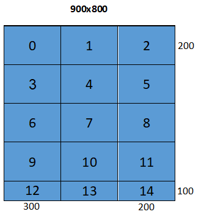

Background
==========

Tiling
------

The **data** accessed by a function can be made to fit in local memory
by **partitioning its control-flow** into stages, such that the data accessed by
each stage fits in local memory. In all cases considered, this partitioning takes
the form *Loop Tiling*, where an initial unfitting loop nest such as:

.. code-block:: c

  for (int y = 0; y < TooManyRows; ++y)
    for (int x = 0; x < TooManyColumns; ++x)
      A[y * StrideA + x] = B[y * StrideB + x] + 1;

is strip-mined/blocked/tiled in (either or) both loops to produce:

.. code-block:: c

 for (int y = 0; y < TooManyRows; y += TileY)
   for (int x = 0; x < TooManyColumns; x += TileX) {
     // Start of stage.
     for (int yy = y; yy < min(y + TileY , TooManyRows); ++yy)
       for (int xx = x; xx < min(x + TileX, TooManyColumns); ++xx)
         A[yy * StrideA + xx] = B[yy * StrideB + xx] + 1;
     // End of stage.
   }

Loop tiling produces an outer-loop, in the above case a doubly-nested
outer-loop, that iterates over stages or tiles. These outer loops could be
represented as:

.. code-block:: c

 for (int tile_id = 0; tile_id < number_of_tiles; ++tile_id) {
   // Derive y, x, and tile parameters from tile_id.
 }

Notice that both arrays A and B in the above example are tiled together. Arrays
with multiple accesses of distinct offsets, such as in stencil access patterns,
result in tiles that overlap. Arrays that are accessed with non-unit strides
should be allocated increased memory accordingly along the x dimension - as if
their element size has increased.

This transformation partitions or tiles the *Iteration Space* of a nested loop,
thereby also partitioning or tiling the *Memory Space* of each array accessed in
the loop. Tiling traditionally involves a single (usually 2D) tile size which
applies to the outer-loop of a loop-nest in terms of iterations, and thereby to
all tiled arrays of the loop in terms of elements. It can be extended to
multiple loops by conceptually fusing them together. Each array however may
require a distinct tile size due to its unique access pattern, and to be bumped
by a unique stride along a distinct loop dimension.

Once a loop and the arrays it accesses have been tiled, the operations involved
with copying the data of each tile can be double buffered and pipelined
across loop iterations, thereby overlapping data communication with computation,
and overlapping asynchronous imports and exports.

Design Principles
-----------------

The Tensor Tiling Library is designed to be

-   **Transparent**: the types and functions of the library are all exposed and
    visible to the user; there are no hidden components. This helps clarify
    exactly what the library supports, and how.

-   **Modular**: the library provides several constructs that can be used
    separately or in combination. This includes a construct for tensors, for
    regular tiling, a construct for importing and exporting single tiles, and a
    construct for pipelining a single or pairs of import/export transactions.

-   **Extensible**: any part of the library can be copied and modified locally;
    new parts can be added locally to the library. Modification and additions
    regarded as generally useful should be considered for inclusion in the
    library.

-   **Easy to use**: provides simple and easy to use patterns, all included in
    header-files only.

A *tile* is considered to be a memory region that can be copied asynchronously.
Therefore, a tile is in general a 3-dimensional *tensor* of elements, embedded
within an enclosing memory layout.

In TTL tiles are defined with optional overlap in every dimension (see next
section). For example, the following figure shows the tiling along x-dimension
produced by a tiler with 2D space shape of (5, 250), 2D tile shape of (5, 5),
and **overlap.width** = 1, so that every pair of horizontally-adjacent tiles has
one column of elements in common:

.. image:: images/overlap.jpg
    :alt: Tile overlap

The following figure shows all 15 tiles produced by a non-overlapping tiler with
2D space shape of {900, 800} and 2D tile shape of {200, 300}.

Note that tiles appearing last in each dimension are of smaller size - the
remainder of dividing 900 by 200 and 800 by 300. Each tile has a unique ID from
zero to **number_of_tiles**-1, following row-major or column-major order:

The following sections describe the layers of API provided by TTL.